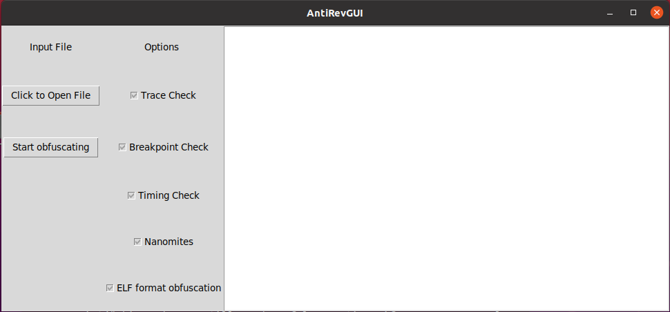

# AntiRevGUI
AntiRevGUI is a front end to the three tools APAKER, ANTIANAPY and ELFREVGO. It provides an easy user interface and combines the three tools together so users pick and chose between multiple obfuscation types.
## INSTALLATION
AntiRevGUI requires tkinter to be installed. Normally this comes together with every python distribution. To install the tool, simply download this repository. You don't need to download the other three tools because they are included in this repository.
## Usage
AntiRevGUI is really easy to use. To start the GUI, simply type in ```./AntiRevGUI.py``` in the folder.
Once started, you will find the following window:

The big panel on the right is used to display information about the different obfuscation techniques. You can open a file, either a C source file or an ELF file and then pick the obfuscation types you want to use. Once you've decided on what you want to implement, click on the "Start obfuscation" button. You will find an **antirevgui_output** executable in your current directory that implements all your chosen protections.
## Extension
Different options for gcc that help obfuscate compiled files even further, like stripping sections, can be added to enhance AntiRevGUI's capabilities.
